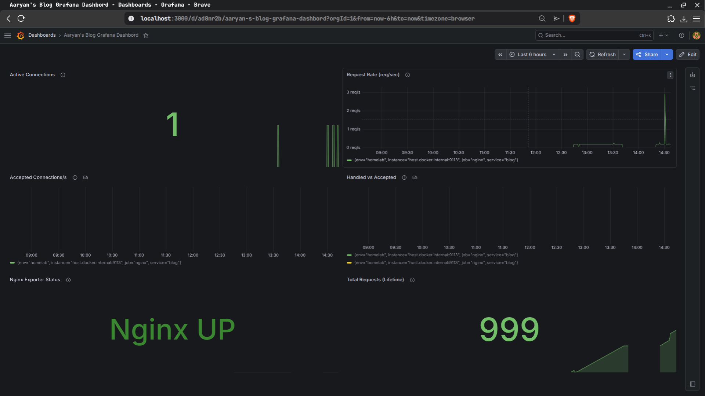
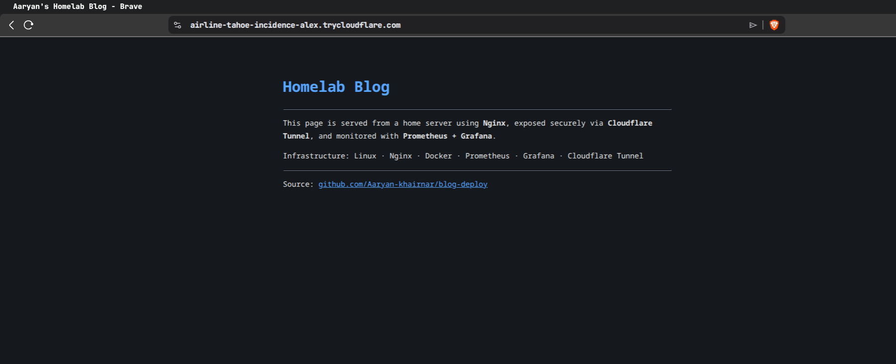
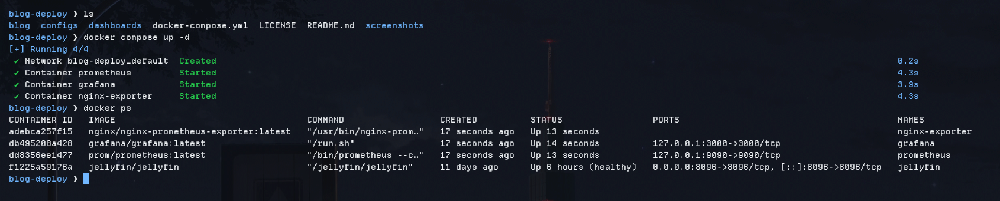
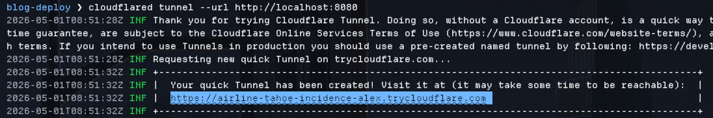
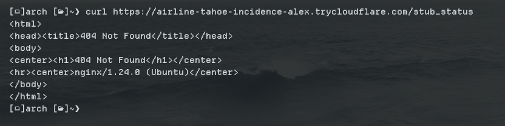
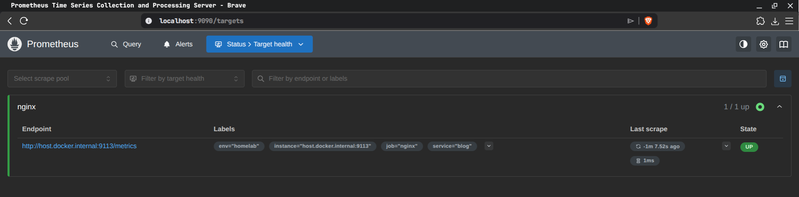
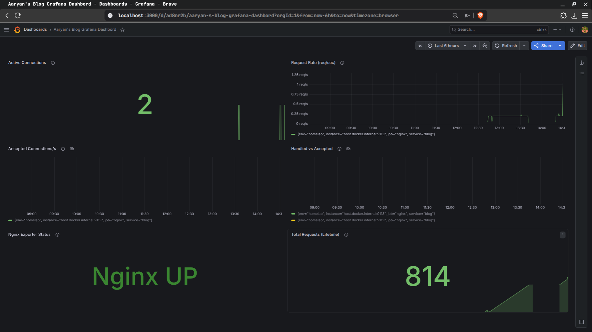

# Homelab Blog Deployment

A small homelab deployment project that serves a static blog from a headless Ubuntu server using **Nginx**, exposes it temporarily through **Cloudflare Quick Tunnel**, and monitors it using **Prometheus + Grafana**.

The main focus of this project is not the blog page itself, but the infrastructure around it:

- public blog hosting from a home server
- no router port forwarding
- no public home IP exposure
- separate public and private Nginx endpoints
- local-only monitoring stack
- Prometheus metrics collection
- Grafana dashboard visualization
- SSH forwarding for accessing dashboards on a headless server

---

## Preview

Grafana Dashboard:  



Public Blog (Accessed through Cloudflare tunnel link):  

  

[Note]: The cloudflare tunnel link is no longer accessible and running.

---

## Architecture

```text
                         PUBLIC SIDE
┌──────────────────────────────────────────────────────────────┐
│                                                              │
│  Internet user                                               │
│       │                                                      │
│       ▼                                                      │
│  trycloudflare.com temporary URL                             │
│       │                                                      │
│       ▼                                                      │
│  cloudflared tunnel                                          │
│       │                                                      │
│       ▼                                                      │
│  Nginx localhost:8080                                        │
│       │                                                      │
│       ▼                                                      │
│  /var/www/blog/index.html                                    │
│                                                              │
└──────────────────────────────────────────────────────────────┘


                        PRIVATE MONITORING SIDE
┌──────────────────────────────────────────────────────────────┐
│                                                              │
│  Nginx localhost:8079/stub_status                            │
│       │                                                      │
│       ▼                                                      │
│  nginx-prometheus-exporter localhost:9113/metrics            │
│       │                                                      │
│  Prometheus localhost:9090                                   │
│       │                                                      │
│       ▼                                                      │
│  Grafana localhost:3000                                      │
│                                                              │
└──────────────────────────────────────────────────────────────┘
```

The public side exposes only the static blog.

The private monitoring side stays local to the server. Prometheus and Grafana are not exposed publicly.

---

## Why This Setup?

A common mistake is exposing `/stub_status` on the same public Nginx listener that serves the website.

This project avoids that.

Nginx has two separate listeners:

```text
localhost:8080
```

used for the public blog.

```text
127.0.0.1:8079/stub_status
```

used only for local Nginx metrics.

The Cloudflare tunnel forwards traffic only to:

```text
http://localhost:8080
```

So public users can access the blog, but not the internal metrics endpoint.

Expected behavior:

```text
Public URL /                 → blog page
Public URL /stub_status      → 404 Not Found
127.0.0.1:8079/stub_status   → Nginx metrics
```

---

## Repository Structure

```text
blog-deploy/
├── README.md
├── docker-compose.yml
├── LICENSE
├── blog/
│   └── index.html
├── configs/
│   ├── nginx.conf
│   ├── prometheus.yml
│   ├── cloudflared_config.example.yml
│   └── alert_rules.example.yml
├── dashboards/
│   └── blog_monitor_dashboard.json
└── screenshots/
```

---

## Where Configs Are Stored

## Where Configs Are Stored

| Component | Source in Repository | Runtime Location | Notes |
|---|---|---|---|
| Static blog | `blog/index.html` | `/var/www/blog/index.html` | Copied manually to the Nginx web root. |
| Nginx config | `configs/nginx.conf` | `/etc/nginx/sites-available/blog` | Activated through a symlink in `/etc/nginx/sites-enabled/blog`. |
| Nginx default site | N/A | `/etc/nginx/sites-enabled/default` | Disabled/removed to avoid conflicts with the custom blog config. |
| Prometheus config | `configs/prometheus.yml` | `/etc/prometheus/prometheus.yml` inside the container | Mounted by Docker Compose. Do not manually create this on the host `/etc`. |
| Grafana dashboard | `dashboards/blog_monitor_dashboard.json` | Imported through the Grafana UI | Used to recreate the dashboard panels. |
| Cloudflare named tunnel config | `configs/cloudflared_config.example.yml` | Optional: `/etc/cloudflared/config.yml` | Only needed for a future named tunnel/custom domain setup. Not used in the Quick Tunnel demo. |
| Alert rules | `configs/alert_rules.example.yml` | Optional: `/etc/prometheus/alert_rules.yml` inside the container | Example only. Alerting is not enabled by default. |

---

## Ports Used

|   Port | Service                   | Exposure                         |
| -----: | ------------------------- | -------------------------------- |
| `8080` | Nginx static blog         | Public through Cloudflare tunnel |
| `8079` | Nginx `stub_status`       | Localhost only                   |
| `9113` | Nginx Prometheus Exporter | Local monitoring                 |
| `9090` | Prometheus                | Localhost only                   |
| `3000` | Grafana                   | Localhost only                   |

Prometheus and Grafana are bound to `127.0.0.1`, so they are not directly reachable from other machines on the network.

Access from a laptop is done through SSH port forwarding.

---

## Setup Summary

## Start Monitoring Stack

From the project root:

```bash
docker compose up -d
```

This starts:

```text
nginx-exporter
prometheus
grafana
```

Check containers:

```bash
docker ps
```

Test exporter:

```bash
curl -i http://127.0.0.1:9113/metrics
```

---

## Start Temporary Cloudflare Tunnel

Run:

```bash
cloudflared tunnel --url http://localhost:8080
```

Cloudflare will generate a temporary public URL like:

```text
https://random-name.trycloudflare.com
```

This URL is temporary and may change after restarting `cloudflared`.

This project intentionally uses Quick Tunnel for demo purposes, so no domain is required.

---

## Grafana Data Source

Inside Grafana, add Prometheus as a data source.

Use this URL:

```text
http://prometheus:9090
```

Grafana and Prometheus are in the same Docker Compose network, so Grafana can reach Prometheus using the service name `prometheus`.

---

## Dashboard

The dashboard JSON is stored at:

```text
dashboards/blog_monitor_dashboard.json
```

Import it in Grafana:

```text
Dashboards → New → Import → Upload JSON
```

Dashboard panels include:

| Panel                  | Purpose                                          |
| ---------------------- | ------------------------------------------------ |
| Active Connections     | Current open client connections to Nginx         |
| Request Rate           | HTTP requests per second                         |
| Accepted Connections/s | New accepted client connections per second       |
| Handled vs Accepted    | Compares accepted and handled connections        |
| Exporter Status        | Shows whether Prometheus can scrape the exporter |
| Total Requests         | Lifetime Nginx request count                     |

---

## Useful PromQL Queries

```promql
nginx_connections_active
```

```promql
rate(nginx_http_requests_total[1m])
```

```promql
rate(nginx_connections_accepted[1m])
```

```promql
rate(nginx_connections_handled[1m])
```

```promql
up{job="nginx"}
```

```promql
nginx_http_requests_total
```

---

## Stop Everything

Stop the Cloudflare tunnel:

```text
Ctrl + C
```

Stop the monitoring stack:

```bash
docker compose down
```

Optional: stop Nginx too.

```bash
sudo systemctl stop nginx
```

Do not use this unless you want to delete Grafana and Prometheus data:

```bash
docker compose down -v
```

---

## Data Persistence

Grafana and Prometheus data are stored in Docker volumes:

```text
grafana_data
prometheus_data
```

Normal shutdown keeps data:

```bash
docker compose down
```

This removes stored data:

```bash
docker compose down -v
```

---

## Security Notes

* Cloudflare Tunnel exposes only the Nginx blog listener on port `8080`.
* `/stub_status` on the public listener returns `404`.
* Real Nginx metrics are only available at `127.0.0.1:8079/stub_status`.
* Prometheus is bound to `127.0.0.1:9090`.
* Grafana is bound to `127.0.0.1:3000`.
* Grafana signups and anonymous access are disabled.
* Internal dashboards are accessed through SSH port forwarding, not public exposure.

---

## Screenshots

### Docker Compose monitoring stack



### Cloudflare Quick Tunnel



### Public blog through TryCloudflare


### Public `/stub_status` blocked



### Prometheus targets



### Grafana dashboard




---

## This project demonstrates:

* Nginx static site hosting
* Cloudflare Quick Tunnel usage
* public/private endpoint separation
* local-only observability endpoints
* Docker Compose monitoring stack
* Prometheus scraping
* Grafana dashboards
* SSH port forwarding for headless server access
* basic homelab deployment security practices

---

## Future Improvements

* Use a named Cloudflare Tunnel with a custom domain
* Add Prometheus Alertmanager
* Add Loki for Nginx logs
* Add Docker healthchecks
* Add automated Grafana provisioning
* Add GitHub Actions for config checks
* Add a deployment script
* Add systemd hardening notes

---

## License
MIT License

